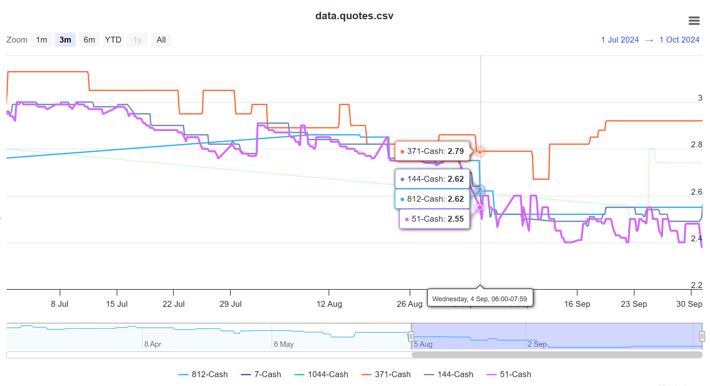
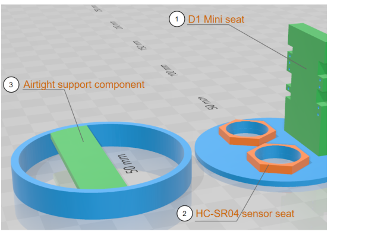

## Home Cloud-Based Heating Oil Monitoring and Ordering Decision System

## 1. System Introduction

This project developed a smart IoT system that combines a **Raspberry Pi Zero** as the central home cloud server (Running **Node-RED** and **MQTT** broker) with distributed smart **ultrasonic sensors** (based on the **D1 Mini-ESP8266**) to monitor home heating oil levels. The system sends alerts to your phone when oil levels drop below a set threshold and features **one-button ordering** from the best deal in the marketplace. This star architecture can easily be extended to other smart home applications, such as sump pit water level monitoring, as demonstrated in Figure 1.

    

                                            **Figure 1. System architecture**   

## 2. Source code structure

[**`/gauge/src/`**](https://github.com/eskyh/OilSense/tree/main/gauge/src)

[`main.cpp`](https://github.com/eskyh/OilSense/tree/main/gauge/src/main.cpp): The main function of **D1 Mini (ESP8266)** microcontroller firmware. It calls `EspClient` class below to do:

`setup()` : Executed once at the start of the program, typically used for configuration and hardware initialization. This includes loading configurations, establishing WiFi/MQTT/OTA connections, initializing sensors, and syncing time with the NTP server.

`loop()` : Executed repeatedly (hence the name 'loop'). The `loop()` function handles tasks such as sensor measurements, MQTT subscribing/publishing messages, processing MQTT actuator commands, managing the web portal, uploading firmware via WiFi, and restarting the device.

    

[**`/myLibs/network/`**](https://github.com/eskyh/OilSense/tree/main/myLibs/network)

[`EspClient.hpp`](https://github.com/eskyh/OilSense/tree/main/myLibs/network/EspClient.hpp), [`EspClient.cpp`](https://github.com/eskyh/OilSense/tree/main/myLibs/network/EspClient.cpp): Main class contol function, singleton.

[`JTimer.h`](https://github.com/eskyh/OilSense/tree/main/myLibs/network/JTimer.h), [`JTimer.cpp`](https://github.com/eskyh/OilSense/tree/main/myLibs/network/JTimer.cpp): Main timer class function used in EspClient class, singleton.

[`Config.hpp`](https://github.com/eskyh/OilSense/tree/main/myLibs/network/Config.hpp), [`Config.cpp`](https://github.com/eskyh/OilSense/tree/main/myLibs/network/Config.cpp) : The configuration management function class

    

[**`/myLibs/sensors/`**](https://github.com/eskyh/OilSense/tree/main/myLibs/sensors)

[`sensor.hpp`](https://github.com/eskyh/OilSense/tree/main/myLibs/sensors/sensor.hpp), [`sensor.cpp`](https://github.com/eskyh/OilSense/tree/main/myLibs/sensors/sensor.cpp): The base **Sensor** calss for other derived sensors below:

- [`sr04.hpp`](https://github.com/eskyh/OilSense/tree/main/myLibs/sensors/sr04.hpp), [`sr04.cpp`](https://github.com/eskyh/OilSense/tree/main/myLibs/sensors/sr04.cpp): Ultrasonic range sensor class for the HC-SR04.

- [`dht11.hpp`](https://github.com/eskyh/OilSense/tree/main/myLibs/sensors/dht11.hpp), [`dht11.cpp`](https://github.com/eskyh/OilSense/tree/main/myLibs/sensors/dht11.cpp): Temperature and humidity sensor class for DHT11.

- [`vl53l0x.hpp`](https://github.com/eskyh/OilSense/tree/main/myLibs/sensors/vl53l0x.hpp), [`vl53l0x.cpp`](https://github.com/eskyh/OilSense/tree/main/myLibs/sensors/vl53l0x.cpp): Infrared distance sensor class for VL53L0X.

    

[`filter.hpp`](https://github.com/eskyh/OilSense/tree/main/myLibs/sensors/filter.hpp), [`filter.cpp`](https://github.com/eskyh/OilSense/tree/main/myLibs/sensors/filter.cpp): Data filtering algorithm classes: **Median**, **Kalman**, **EWMA**.

[`band.hpp`](https://github.com/eskyh/OilSense/tree/main/myLibs/sensors/band.hpp), [`band.cpp`](https://github.com/eskyh/OilSense/tree/main/myLibs/sensors/band.cpp):  Band filter class supporting both dead band and narrow band.

    

The **`Sensor`** base class encapsulates common functionalities shared across all sensor types, such as:

* `_read()`: A pure virtual function that each derived sensor class implements to handle sensor-specific reading logic.  
* `setFilter()`: Allows the assignment of a filter (e.g., Median, Kalman, EWMA) to process sensor data.  
* `setMqtt()`: Set MQTT client for data transmission.  
* `getPayload()`: A pure virtual function that is implemented by each derived class to format the sensor's data for transmission.  
* `sendMeasure()`: A method that handles data communication or publication to an MQTT broker or other destinations.

[**`/gauge/web/`**](https://github.com/eskyh/OilSense/tree/main/gauge/web)

[`main.html`](https://github.com/eskyh/OilSense/tree/main/gauge/web/main.html) : A lightweight, all-in-one web portal developed for smart sensor management. Users can configure settings and perform firmware upgrades over Wi-Fi. This file relies on the following JavaScript and CSS code.

[`espman.js`](https://github.com/eskyh/OilSense/tree/main/gauge/web/espman.js) :  JavaScript code provides the following functions for the web portal: adding/removing sensors, pin configurations, AJAX-based configuration updates, file management, system firmware uploads, and device restarts.

[`filedrag.js`](https://github.com/eskyh/OilSense/tree/main/gauge/web/filedrag.js) :JavaScript code enabling drag-and-drop functionality on the *File Management* page of the web portal.

[`style.css`](https://github.com/eskyh/OilSense/tree/main/gauge/web/style.css) : The stylesheet for the web portal.

[`release.bat`](https://github.com/eskyh/OilSense/tree/main/gauge/web/release.bat) : A batch command file compresses the `main.html` and all supporting script files into a single HTML, then gzips it. This significantly improves web portal access performance.

[`/config/`](https://github.com/eskyh/OilSense/tree/main/gauge/web/config) :  This subfolder contains three sample configuration JSON files.

    

[**`/tools/`**](https://github.com/eskyh/OilSense/tree/main/tools)

[`index.html`](https://github.com/eskyh/OilSense/tree/main/tools/index.html): A web-based tool I developed to display multi-time series data (e.g., oil level data from d`ata.series.csv`) or marketplace quotes from various dealers (e.g., `data.quotes.csv` as shown below).

    

    

[**`/gauge/3d_model/`**](https://github.com/eskyh/OilSense/tree/main/gauge/3d_model)

A series of 3D model of internal structural components designed to support the D1 Mini and connected sensors. `model_final_subtract.3mf` is the final design, while the others are either intermediate versions or older designs where the sensor seat location caused interference with the housing.

